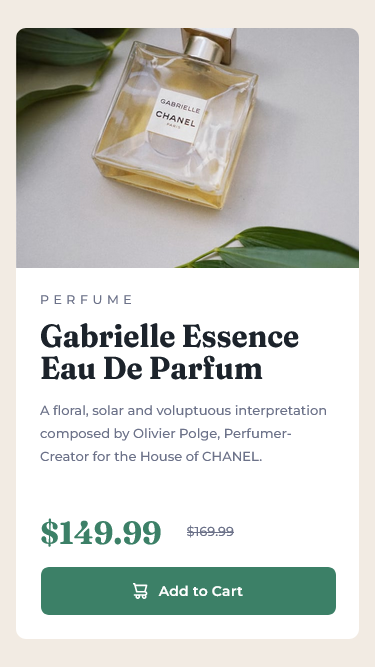
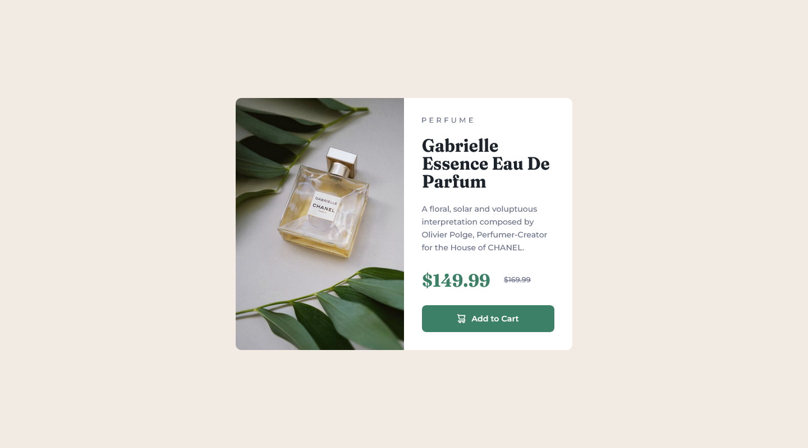

# Frontend Mentor - Product preview card component solution

This is a solution to the [Product preview card component challenge on Frontend Mentor](https://www.frontendmentor.io/challenges/product-preview-card-component-GO7UmttRfa). Frontend Mentor challenges help you improve your coding skills by building realistic projects. 

## Table of contents

- [Overview](#overview)
  - [The challenge](#the-challenge)
  - [Screenshot](#screenshot)
  - [Links](#links)
- [My process](#my-process)
  - [Built with](#built-with)
  - [What I learned](#what-i-learned)
  - [Useful resources](#useful-resources)
- [Author](#author)

## Overview

### The challenge

Users should be able to:

- View the optimal layout depending on their device's screen size
- See hover and focus states for interactive elements

### Screenshot




### Links

- Solution URL: [Solution](https://www.frontendmentor.io/solutions/css-grid-flexbox-ti41IESVnD)
- Live Site URL: [Live Site](https://james-alderson.github.io/Frontend-Mentor/Solutions/01-Product-preview-card-component/index.html)

## My process

### Built with

- Semantic HTML5 markup
- CSS custom properties
- Flexbox
- CSS Grid
- Mobile-first workflow
- [BEM](https://en.bem.info/methodology/) Methodology

### What I learned

In this challenge, I learned to use the ‍ `<picture>` element.

The `<picture>` HTML element contains zero or more `<source>` elements and one `` element to offer alternative versions of an image for different display/device scenarios.

The browser will consider each child `<source>` element and choose the best match among them. If no matches are found—or the browser doesn't support the `<picture>` element—the URL of the `` element's src attribute is selected. The selected image is then presented in the space occupied by the `` element.

To see how you can add code snippets, see below:

```html
<picture>
  <source 
    srcset="./assets/images/image-product-desktop.jpg"
    media="(min-width: 600px)"
  />
  
</picture>
```
### Useful resources

- [The Picture element](https://developer.mozilla.org/en-US/docs/Web/HTML/Element/picture).

## Author

- Frontend Mentor - [@James-alderson](https://www.frontendmentor.io/profile/James-alderson)
