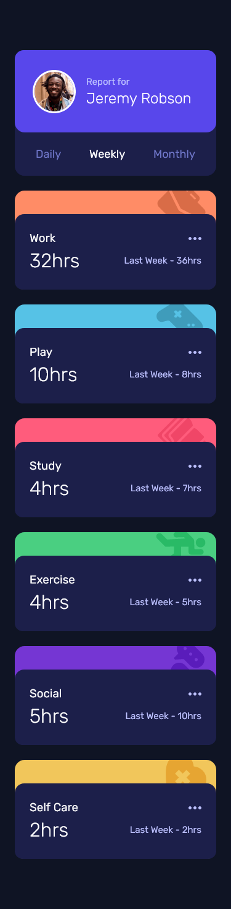

# Frontend Mentor - Time tracking dashboard solution

This is a solution to the [Time tracking dashboard challenge on Frontend Mentor](https://www.frontendmentor.io/challenges/time-tracking-dashboard-UIQ7167Jw). Frontend Mentor challenges help you improve your coding skills by building realistic projects. 

## Table of contents

- [Overview](#overview)
  - [The challenge](#the-challenge)
  - [Screenshot](#screenshot)
  - [Links](#links)
- [My process](#my-process)
  - [Built with](#built-with)
  - [What I learned](#what-i-learned)
  - [Continued development](#continued-development)
  - [Useful resources](#useful-resources)
- [Author](#author)
- [Acknowledgments](#acknowledgments)

## Overview

### The challenge

Users should be able to:

- View the optimal layout for the site depending on their device's screen size
- See hover states for all interactive elements on the page
- Switch between viewing Daily, Weekly, and Monthly stats

### Screenshot




### Links

- Solution URL: [Solution](https://www.frontendmentor.io/solutions/time-tracking-dashboard-nMO9rG7Ziq)
- Live Site URL: [Live Site](https://james-alderson.github.io/Frontend-Mentor/Solutions/10-Time-tracking-dashboard/index.html)

## My process

### Built with

- Semantic HTML5 markup
- Flexbox
- CSS Grid
- Mobile-first workflow
- [Sass](https://sass-lang.com/) - CSS Preprocessor
- [Normalize](https://necolas.github.io/normalize.css/) - CSS Reset
- [BEM](https://en.bem.info/methodology/) - Methodology

### What I learned

In this challenge, I learned to use the ‍`BEM` methodology for naming html elements.

Methodology `BEM` was invented at Yandex to develop sites which should be launched fast and supported for a long time. It helps to create extendable and reusable interface components.

To see how you can add code snippets, see below:

```html
<section class="dashboard">
  <div class="dashboard__card dashboard__card--user">
    <div class="dashboard__user-info">
      
      <div class="dashboard__user-text">
        <span class="dashboard__report dashboard__report--text">Report for</span>
        <h1 class="dashboard__report dashboard__report--user-name">Jeremy Robson</h1>
      </div>
    </div>
    <div class="dashboard__content dashboard__content--user">
      <div class="dashboard__timeframes">
        <button id="timeframeDaily" class="dashboard__btn">Daily</button>
        <button id="timeframeWeekly" class="dashboard__btn dashboard__btn--active">Weekly</button>
        <button id="timeframeMonthly" class="dashboard__btn">Monthly</button>
      </div>
    </div>
  </div>
  ...
</section>
```

In this challenge, I learned to use the `min()` css function.

The `min()` CSS function lets you set the smallest (most negative) value from a list of comma-separated expressions as the value of a CSS property value.

To see how you can add code snippets, see below:

```css
.dashboard {
	display: grid;
	width: min(calc(100vw - 1rem), size(dashboard-small));
	gap: 1.5rem;
	margin: 1rem 0.5rem;
  ...
}
```

In this challenge, I learned to use the `arguments object` in javaScript.

`arguments` is an Array-like object accessible inside functions that contains the values of the arguments passed to that function.

To see how you can add code snippets, see below:

```js
function getReports(idValue) {
  let responseStatus = 0
  buttonStatus(responseStatus)
  fetch(DATA_URL)
    .then(response => {
      responseStatus = response.status
      buttonStatus(responseStatus)
      return response.json()
    })
    .then(data => {
      setReports(data, idValue)
    })
}
```

### Continued development

The following developments have been made:
- Add loading gif.
- Design for tablet and laptop devices.

### Useful resources

- [grid-template-areas](https://developer.mozilla.org/en-US/docs/Web/CSS/grid-template-areas).
- [min()](https://developer.mozilla.org/en-US/docs/Web/CSS/min).
- [cursor](https://developer.mozilla.org/en-US/docs/Web/CSS/cursor).
- [BEM Cheat Sheet](https://9elements.com/bem-cheat-sheet/?ref=tiny-helpers).
- [Writing Clean JavaScript](https://medium.com/geekculture/writing-clean-javascript-es6-edition-834e83abc746).
- [Writing Clean Code in JavaScript](https://blog.bitsrc.io/writing-clean-code-in-javascript-dd584bbe1874).
- [Callback hell in multiple if, else if statements](https://stackoverflow.com/questions/42347068/callback-hell-in-multiple-if-else-if-statements).
- [How to add a .gif pre-loader to your website](https://nishanc.medium.com/how-to-add-a-gif-pre-loader-to-your-website-dcfd29bd055d).
- [Animation Made Easy](https://loading.io/).
- [Preloading responsive images](https://web.dev/preload-responsive-images/).

## Author

- Frontend Mentor - [@James-alderson](https://www.frontendmentor.io/profile/James-alderson)

## Acknowledgments

Inspired by the javascript code of user [@superozzy](https://www.frontendmentor.io/profile/superozzy) to create a system to receive data from a json file and put it in html elements.
