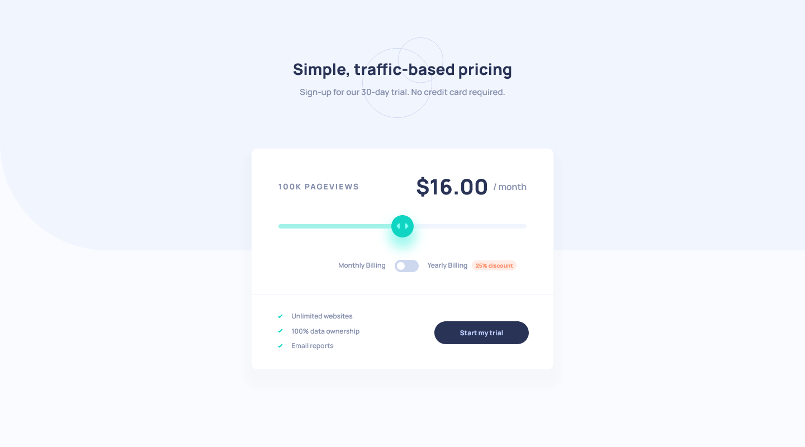

# Frontend Mentor - Interactive pricing component solution

This is a solution to the [Interactive pricing component challenge on Frontend Mentor](https://www.frontendmentor.io/challenges/interactive-pricing-component-t0m8PIyY8). Frontend Mentor challenges help you improve your coding skills by building realistic projects. 

## Table of contents

- [Overview](#overview)
  - [The challenge](#the-challenge)
  - [Screenshot](#screenshot)
  - [Links](#links)
- [My process](#my-process)
  - [Built with](#built-with)
  - [What I learned](#what-i-learned)
  - [Continued development](#continued-development)
  - [Useful resources](#useful-resources)
- [Author](#author)

## Overview

### The challenge

Users should be able to:

- View the optimal layout for the app depending on their device's screen size
- See hover states for all interactive elements on the page
- Use the slider and toggle to see prices for different page view numbers

### Screenshot




### Links

- Solution URL: [Solution](https://www.frontendmentor.io/solutions/interactive-pricing-component-XYSAR1FpH1)
- Live Site URL: [live Site](https://james-alderson.github.io/Frontend-Mentor/Solutions/12-Interactive-pricing-component/index.html)

## My process

### Built with

- Semantic HTML5 markup
- Flexbox
- CSS Grid
- Mobile-first workflow
- [Sass](https://sass-lang.com/) - CSS Preprocessor
- [Normalize](https://necolas.github.io/normalize.css/) - CSS Reset
- [BEM](https://en.bem.info/methodology/) - Methodology

### What I learned

#### JavaScript

***Element.toggleAttribute()***

> The `toggleAttribute()` method of the Element interface toggles a Boolean attribute (removing it if it is present and adding it if it is not present) on the given element. 

```js
function checkFunc(event) {
  if (event.key === " " || event.keyCode === 32) {
    BILLING.toggleAttribute("checked")
    billFunc()
  }
}
```

### Continued development

- Create sass build process.
- Challenge design for small resolution.

### Useful resources

- [Range](https://developer.mozilla.org/en-US/docs/Web/HTML/Element/input/range)
- [Custom range sliders](https://www.w3schools.com/howto/howto_js_rangeslider.asp)
- [Custom checkbox example](https://codepen.io/mburnette/pen/LxNxNg/?editors=1100)
- [Element.toggleAttribute()](https://developer.mozilla.org/en-US/docs/Web/API/Element/toggleAttribute)
- [Call two functions from one event](https://stackoverflow.com/questions/16025138/call-two-functions-from-same-onclick)
- [Understanding of Font Formats](https://medium.com/@aitareydesign/understanding-of-font-formats-ttf-otf-woff-eot-svg-e55e00a1ef2)

## Author

- Frontend Mentor - [@James-alderson](https://www.frontendmentor.io/profile/James-alderson)
