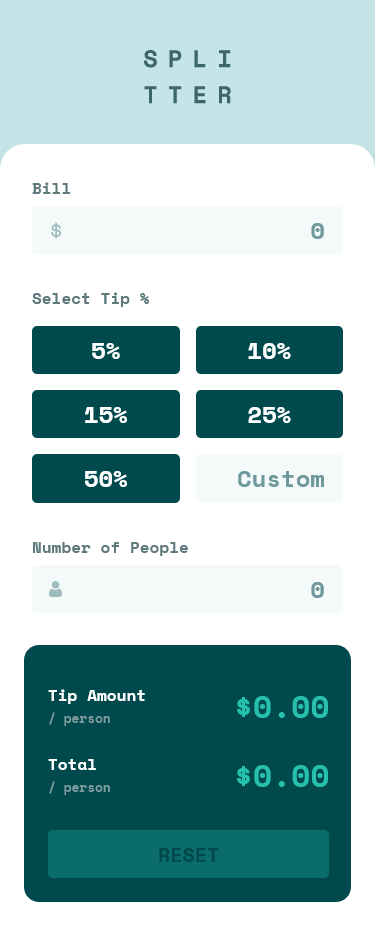
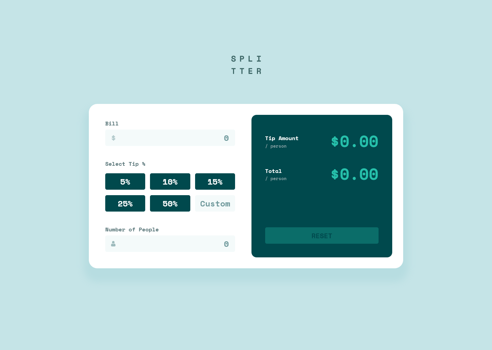

# Frontend Mentor - Tip calculator app solution

This is a solution to the [Tip calculator app challenge on Frontend Mentor](https://www.frontendmentor.io/challenges/tip-calculator-app-ugJNGbJUX). Frontend Mentor challenges help you improve your coding skills by building realistic projects.

## Table of contents

- [Overview](#overview)
  - [The challenge](#the-challenge)
  - [Screenshot](#screenshot)
  - [Links](#links)
- [My process](#my-process)
  - [Built with](#built-with)
  - [What I learned](#what-i-learned)
  - [Continued development](#continued-development)
  - [Useful resources](#useful-resources)
- [Author](#author)

## Overview

### The challenge

Users should be able to:

- View the optimal layout for the app depending on their device's screen size
- See hover states for all interactive elements on the page
- Calculate the correct tip and total cost of the bill per person

### Screenshot




### Links

- Solution URL: [Solution](#)
- Live Site URL: [Live Site](#)

## My process

### Built with

- Semantic HTML5 markup
- CSS custom properties
- Flexbox
- CSS Grid
- Mobile-first workflow
- [Sass](https://sass-lang.com/) - CSS Preprocessor
- [Normalize](https://necolas.github.io/normalize.css/) - CSS Reset
- [BEM](https://en.bem.info/methodology/) - Methodology

### What I learned

#### HTML

***tabindex***

> The `tabindex` global attribute indicates that its element can be focused, and where it participates in sequential keyboard navigation (usually with the `Tab` key, hence the name).

***ARIA: button role***

> The `button` role is for clickable elements that trigger a response when activated by the user. Adding `role="button"` tells the screen reader the element is a button.

```html
<div class="tip">
  <input id="tip_5" class="input input__radio" type="radio" name="tip" value="5">
  <label for="tip_5" tabindex="0" role="button">5%</label>
</div>
```
#### JavaScript

***Conditional (ternary) operator***

> The conditional (ternary) operator is the only JavaScript operator that takes three operands: a condition followed by a question mark (`?`), then an expression to execute if the condition is truthy followed by a colon (`:`), and finally the expression to execute if the condition is falsy. This operator is frequently used as an alternative to an `if...else` statement. 

```js
let tipValue = (customTipValue) ? customTipValue : Number(buttonsTip.value)
```
***Number.prototype.toFixed()***

>  The toFixed() method formats a number using fixed-point notation. 

```js
TIP_AMOUNT.innerHTML = `$${tipAmount.toFixed(2)}`
TOTAL.innerHTML = `$${total.toFixed(2)}`
```

***HTMLElement: input event***

> The `input` event fires when the `value` of an `<input>`, `<select>`, or `<textarea>` element has been changed.

```js
BILL.addEventListener("input", event => {
  validateValue(event.target.value)
})
CUSTOM_TIP.addEventListener("input", event => {
  validateValue(event.target.value)
})
PEOPLE.addEventListener("input", event => {
  validateValue(event.target.value, true)
})
```

### Continued development
- Challenge design for another resolutions: (medium, large, xlarge).
- Create sass build process.

### Useful resources

- [ARIA: button role](https://developer.mozilla.org/en-US/docs/Web/Accessibility/ARIA/Roles/button_role)
- [tabindex](https://developer.mozilla.org/en-US/docs/Web/HTML/Global_attributes/tabindex)
- [Conditional (ternary) operator](https://developer.mozilla.org/en-US/docs/Web/JavaScript/Reference/Operators/Conditional_Operator)
- [Number.prototype.toFixed()](https://developer.mozilla.org/en-US/docs/Web/JavaScript/Reference/Global_Objects/Number/toFixed)
- [HTMLElement: input event](https://developer.mozilla.org/en-US/docs/Web/API/HTMLElement/input_event)
- [prefers-reduced-motion: Sometimes less movement is more](https://web.dev/prefers-reduced-motion/)
- [Hide Arrows From Input Number](https://www.w3schools.com/howto/howto_css_hide_arrow_number.asp)
- [NPM](https://www.youtube.com/watch?v=jHDhaSSKmB0)
- [Creating build process](https://dev.to/heytulsiprasad/make-your-css-production-ready-by-creating-a-build-process-1do8)

## Author

- Frontend Mentor - [@James-alderson](https://www.frontendmentor.io/profile/James-alderson)
